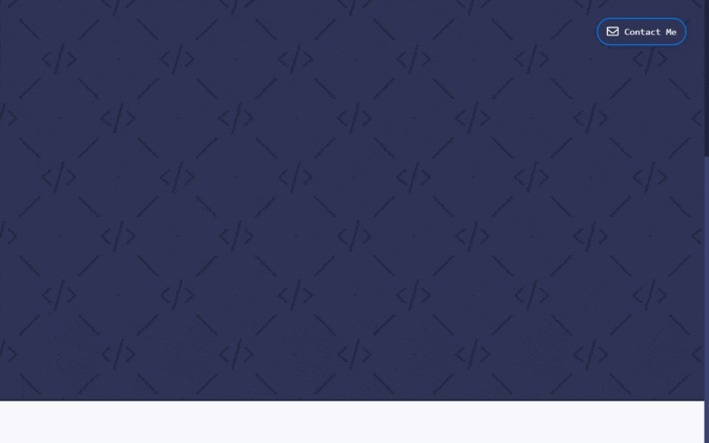

# nice-anim

[![Built With Stencil](https://img.shields.io/badge/-Built%20With%20Stencil-16161d.svg?logo=data%3Aimage%2Fsvg%2Bxml%3Bbase64%2CPD94bWwgdmVyc2lvbj0iMS4wIiBlbmNvZGluZz0idXRmLTgiPz4KPCEtLSBHZW5lcmF0b3I6IEFkb2JlIElsbHVzdHJhdG9yIDE5LjIuMSwgU1ZHIEV4cG9ydCBQbHVnLUluIC4gU1ZHIFZlcnNpb246IDYuMDAgQnVpbGQgMCkgIC0tPgo8c3ZnIHZlcnNpb249IjEuMSIgaWQ9IkxheWVyXzEiIHhtbG5zPSJodHRwOi8vd3d3LnczLm9yZy8yMDAwL3N2ZyIgeG1sbnM6eGxpbms9Imh0dHA6Ly93d3cudzMub3JnLzE5OTkveGxpbmsiIHg9IjBweCIgeT0iMHB4IgoJIHZpZXdCb3g9IjAgMCA1MTIgNTEyIiBzdHlsZT0iZW5hYmxlLWJhY2tncm91bmQ6bmV3IDAgMCA1MTIgNTEyOyIgeG1sOnNwYWNlPSJwcmVzZXJ2ZSI%2BCjxzdHlsZSB0eXBlPSJ0ZXh0L2NzcyI%2BCgkuc3Qwe2ZpbGw6I0ZGRkZGRjt9Cjwvc3R5bGU%2BCjxwYXRoIGNsYXNzPSJzdDAiIGQ9Ik00MjQuNywzNzMuOWMwLDM3LjYtNTUuMSw2OC42LTkyLjcsNjguNkgxODAuNGMtMzcuOSwwLTkyLjctMzAuNy05Mi43LTY4LjZ2LTMuNmgzMzYuOVYzNzMuOXoiLz4KPHBhdGggY2xhc3M9InN0MCIgZD0iTTQyNC43LDI5Mi4xSDE4MC40Yy0zNy42LDAtOTIuNy0zMS05Mi43LTY4LjZ2LTMuNkgzMzJjMzcuNiwwLDkyLjcsMzEsOTIuNyw2OC42VjI5Mi4xeiIvPgo8cGF0aCBjbGFzcz0ic3QwIiBkPSJNNDI0LjcsMTQxLjdIODcuN3YtMy42YzAtMzcuNiw1NC44LTY4LjYsOTIuNy02OC42SDMzMmMzNy45LDAsOTIuNywzMC43LDkyLjcsNjguNlYxNDEuN3oiLz4KPC9zdmc%2BCg%3D%3D&colorA=16161d&style=flat-square)](https://stenciljs.com/)
[](https://www.npmjs.com/package/nice-anim)

<div align="center">
  <br>
  <i>Example of use from nick.winans.codes</i>
</div>

## What is it?
nice-anim is a Web Component that allows you to easily animate elements when scrolled into view by wrapping them.

## Usage
```html
<nice-anim direction="up" duration="500">
  <p>Animating text!</p>
</nice-anim>
```

#### All of the props can be found in the component's [README](src/components/nice-anim/readme.md)

## Installation
There are 3 options to install `nice-anim`.

### Script tag
 - Put `<script src='https://unpkg.com/nice-anim/dist/nice-anim.js'></script>` in the head of your index.html.
 - Then you can use the element anywhere in your template, JSX, html etc.

### Node Modules
 - Run `npm install nice-anim --save`
 - Put `<script src='node_modules/nice-anim/dist/nice-anim.js'></script>` in the head of your index.html.
 - Then you can use the element anywhere in your template, JSX, html etc.

### In a stencil-app-starter app
 - Run `npm install nice-anim --save`
 - Add `import 'nice-anim';`
 - Then you can use the element anywhere in your template, JSX, html etc.

## Intersection Observer Polyfill
[Some browsers don't have the Intersection Observer API.](https://caniuse.com/#search=intersectionobserver) You can include the following script to add support to those browsers without it.

`<script src="https://polyfill.io/v2/polyfill.min.js?features=IntersectionObserver"></script>`

You can read more about Intersection Observer polyfills [here](https://github.com/w3c/IntersectionObserver/tree/master/polyfill).
